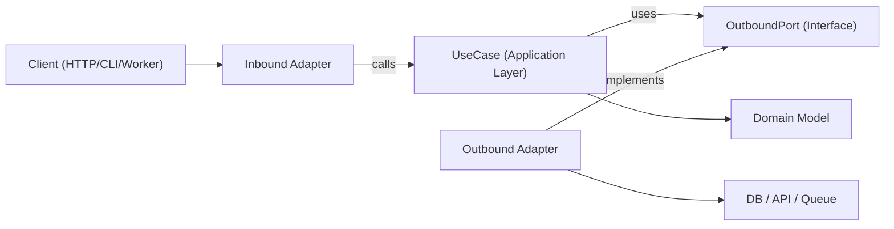

# Hexagonal Architecture (Ports & Adapters)

Keeps business logic independent from frameworks, transport, and persistence. The core application depends on abstract ports; adapters implement those ports at the edges.

## When to Use

- Building new features where long-term testability and maintainability matter.
- Refactoring layered or framework-heavy code where domain logic is entangled with I/O.
- Supporting multiple transports for the same use case (HTTP, CLI, queue worker, cron job).
- Replacing infrastructure (database, external API, message bus) without rewriting business rules.

## Core Concepts

| Layer | Responsibility | Constraint |
|---|---|---|
| **Domain** | Business rules, entities, value objects | No framework or infrastructure imports |
| **Application (Use Cases)** | Orchestrate domain behavior | Depends only on domain + port interfaces |
| **Inbound Ports** | Contracts for what the app can do | Interfaces/types in application layer |
| **Outbound Ports** | Contracts for what the app needs | Interfaces/types in application layer |
| **Adapters** | Implement ports with real infrastructure | HTTP controllers, DB repos, SDK wrappers |
| **Composition Root** | Wires concrete adapters into use cases | Single, auditable wiring location |

**Dependency direction is always inward:**
```
Adapters → Application/Domain
Application → Port interfaces
Domain → nothing external
```

## Architecture Diagram



## Procedure

### Step 1 — Model the use case boundary
Define a single use case with an explicit input DTO and output DTO. Strip all transport details (`req`, `res`, queue wrappers) before the boundary.

### Step 2 — Define outbound ports first
Identify every side effect as a named port:
- Persistence → `OrderRepositoryPort`
- External services → `PaymentGatewayPort`
- Cross-cutting → `LoggerPort`, `ClockPort`, `UuidPort`

Ports model **capabilities**, not technologies.

### Step 3 — Implement the use case with pure orchestration
Use case class/function receives ports via constructor injection. It validates application-level invariants, coordinates domain rules, and returns plain data structures. No framework types enter here.

### Step 4 — Build adapters at the edges
- **Inbound adapter**: converts protocol input → use-case input; maps output/errors → protocol response.
- **Outbound adapter**: maps app port contract → concrete API/ORM/query builder.
- All mapping stays in adapters, never inside use cases.

### Step 5 — Wire everything in a composition root
Instantiate adapters, inject them into use cases. Keep wiring in one auditable place; avoid hidden global singletons or service-locator patterns.

### Step 6 — Test per boundary
- **Domain tests**: pure business rules, no mocks.
- **Use-case unit tests**: fake/stub every outbound port; assert outcomes and interactions.
- **Adapter contract tests**: run against each adapter implementation.
- **Inbound adapter tests**: verify protocol mapping in both directions.
- **Integration tests**: real infrastructure (DB, API, queue).
- **E2E tests**: critical user journeys end-to-end.

See [testing guidance](./references/testing.md) for detailed patterns.

## Suggested Module Layout

Feature-first organization with explicit boundaries:

```text
src/
  features/
    orders/
      domain/
        Order.ts
        OrderPolicy.ts
      application/
        ports/
          inbound/
            CreateOrder.ts        ← use-case input/output types
          outbound/
            OrderRepositoryPort.ts
            PaymentGatewayPort.ts
        use-cases/
          CreateOrderUseCase.ts
      adapters/
        inbound/
          http/
            createOrderRoute.ts
        outbound/
          postgres/
            PostgresOrderRepository.ts
          stripe/
            StripePaymentGateway.ts
      composition/
        ordersContainer.ts        ← composition root
```

## Multi-Language Mapping

| Language | Ports location | Use-case style | Wiring |
|---|---|---|---|
| **TypeScript** | `application/ports/*` as interfaces | Class or function with constructor/arg injection | Explicit factory module |
| **Java** | `application.port.in` / `application.port.out` | Plain class (`@Service` optional) | Spring `@Configuration` or manual wiring class |
| **Kotlin** | `application.port` interfaces | Class with constructor injection (Koin/Dagger/Spring/manual) | Module definitions or composition functions |
| **Go** | Small interfaces in the consuming `application` package | Structs with interface fields + `New…` constructors | Wire in `cmd/<app>/main.go` |

See [language examples](./references/examples.md) for concrete code samples.

## Anti-Patterns to Avoid

- Domain entities importing ORM models, web framework types, or SDK clients.
- Use cases reading directly from `req`, `res`, or queue metadata.
- Returning database rows directly from use cases without domain/application mapping.
- Adapters calling each other directly instead of flowing through use-case ports.
- Spreading dependency wiring across many files with hidden global singletons.

## Best Practices Checklist

- [ ] Domain and use-case layers import only internal types and port interfaces.
- [ ] Every external dependency has a corresponding outbound port.
- [ ] Validation occurs at boundaries (inbound adapter + use-case invariants).
- [ ] Entities use immutable transformations (return new values instead of mutating state).
- [ ] Infrastructure errors are translated to domain/application errors at adapter boundaries.
- [ ] Composition root is explicit and easy to audit in one place.
- [ ] Use cases are testable with simple in-memory fakes; no real infrastructure needed.
- [ ] Refactoring starts from one vertical slice with behavior-preserving characterization tests.
- [ ] Language/framework specifics stay in adapters — never in domain rules.

## References

- [Code examples (TypeScript + multi-language)](./references/examples.md)
- [Testing guidance](./references/testing.md)
- [Migration playbook for existing systems](./references/migration.md)
